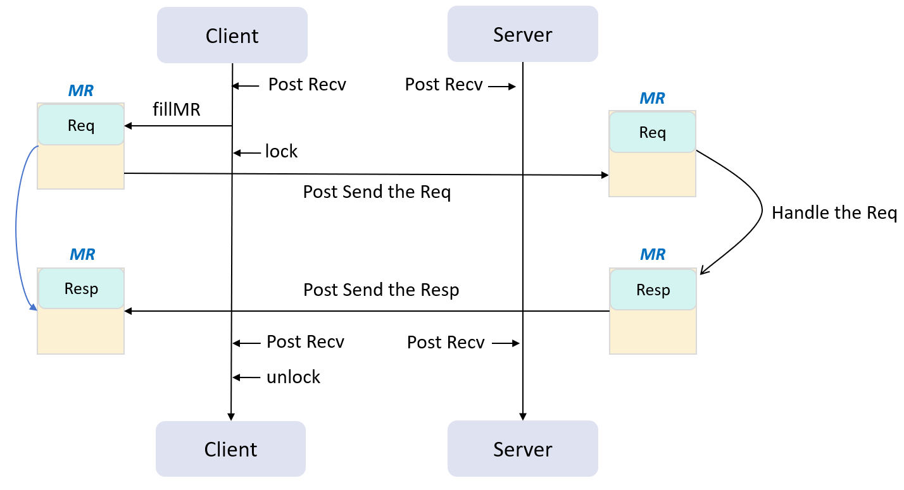

# RDMA-RPC

This is a multi-send & single-receive RPC based on RDMA.

### Env

- Build tool: `CMake` (version 3.10 +)
- Dependent library: `rdmacm`、`ibverbs`、`event`、`pthread`
- Dependent Environment:
  -  RDMA-enabled NIC;
  -  or, Soft-RoCE instead.

``` bash
# load rxe
sudo modprobe rdma_rxe
# set Soft-RoCE, change 'ens33' to your NIC name
sudo rdma link add rxe_0 type rxe netdev ens33
# check if ACTIVE
sudo rdma link
# show the rdma(virtual) device
ibv_devices
```

### How to use

- Set up the environment: 

```bash
. setup_env.sh
```

- Build the lib and example: 

```bash
mkdir build && cd build
cmake ..
make

# tree of build
.
├── app            # example
├── CMakeCache.txt
├── CMakeFiles
├── cmake_install.cmake
├── Makefile
└── src            # lib
```

- Use the lib, for example: 

```bash
# bash-1
./app/server <Listen IP> <port>
# bash-2
./app/client <Server IP> <Server port>
# bash-N
./app/client <Server IP> <Server port>  # same as above
```

- Use the lib, for yourself:

```cpp
// Server
Server s(const char* /*host*/, const char* /*port*/);
s.run();
// Client
Client c;
c.connect(const char* /*server host*/, const char* /*server port*/);
c.sendRequest(string /*msg*/);
```

- Customize your own RPC Handler: 

```cpp
// Implement a subclass of Handler if you'd like customize the rpc
class Handler {
public:
   Message handlerRequest(Message* req);
}
```

### Design

#### Resources Management

- All RDMA resources(pd, mr, qp, cp, etc.) are encapsulated in the Connection class, where each connection corresponds to a link.
- A Client allows only one Connection, whereas a Server allows multiple.
- The Connections are managed and polled through Poller.
- Server uses a single-thread Poller to poll all Connections.

#### RPC Procedure

A RCP procedure for one Connection is depicted in the following diagram: 



### Q&A

- Why not use RDMA Write ?

> Since this is an RPC, the client needs to be aware of the server's response, so there is no need to use "Write". If "Write" is used, the client will have to continuously poll the memory for the server response.

- If I wanna connect multi Server, how can I do this ?

> Just start multi Client objects, each Client connects to a Server.

### To do

- [ ] add the bench to test performance.
- [ ] accelerate the RPC of large request.
- [ ] optimize memory management.

### Reference

- [RDMA mojo](http://www.rdmamojo.com/)
- [Hammer Li's rdma-based-rpc](https://github.com/PDSL-DPU-KV/rdma-based-rpc/tree/master)
- [rdma-example](https://github.com/animeshtrivedi/rdma-example)